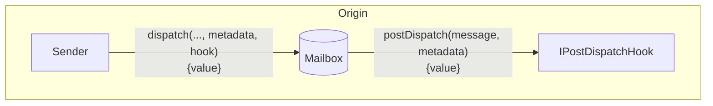
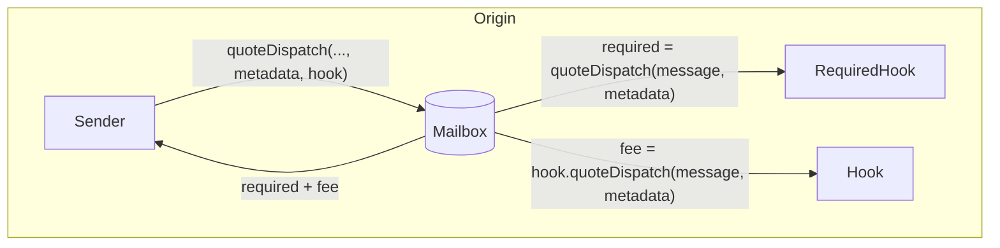
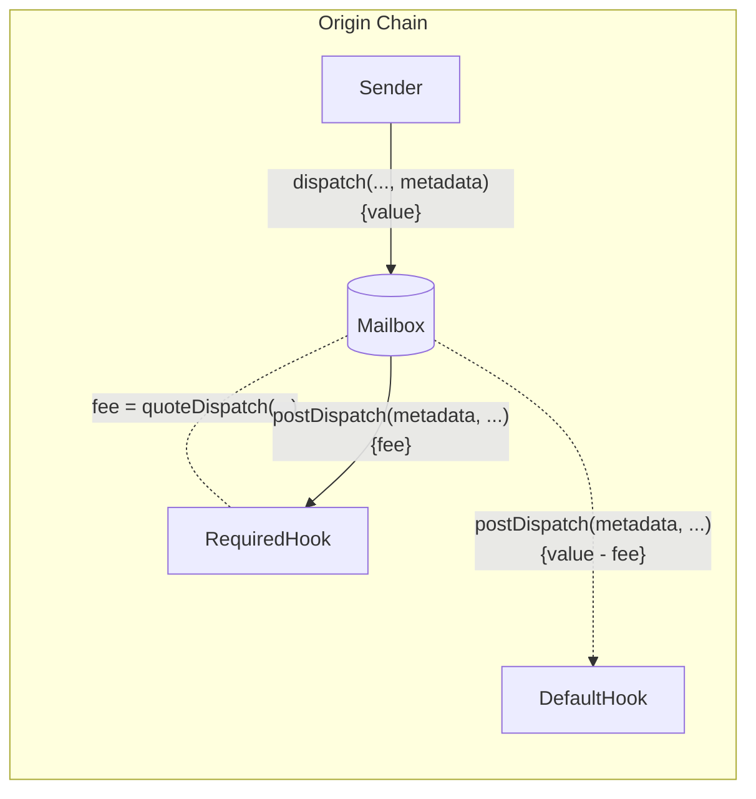

# Post-Dispatch Hooks

Post-dispatch hooks allow developers to configure additional origin chain behavior with message content dispatched via the Mailbox.



This allows developers to integrate third party/native bridges, make additional chain commitments, or require custom fees all while maintaining a consistent single-call Mailbox interface.

<Details>
<summary>`IPostDispatchHook` Interface</summary>

```solidity
interface IPostDispatchHook {
    function hookType() external view returns (uint8);
    function supportsMetadata(bytes calldata metadata) external view returns (bool);
    function requiredGas(bytes calldata message) external view returns (uint256);
    function postDispatch(bytes calldata metadata, bytes calldata message) external payable;
    function quoteDispatch(bytes calldata metadata, bytes calldata message) external view returns (uint256);
}
```

</Details>

## Post Dispatch

In addition to the `message` dispatched via the Mailbox, the `postDispatch` function receives a `metadata` parameter. The `metadata` parameter is passed from the `dispatch` call through the Mailbox unmodified. This allows developers to pass any context they wish through to the hook.

```solidity
function postDispatch(
    bytes calldata metadata,
    bytes calldata message
) external payable;
```

If the `postDispatch` function receives insufficient payment, it may revert.

<Info>
  Post-Dispatch Hooks may be replayable. Developers creating custom hooks should
  implement safe checks to prevent this behavior.
  [Here](https://github.com/hyperlane-xyz/hyperlane-monorepo/blob/b69bc23239ecfc8f8a6277bb0f9bc248cffea234/solidity/contracts/hooks/warp-route/RateLimitedHook.sol#L16)
  is an example implementation.
</Info>

### Quote Dispatch (Fees)

Fees are often charged in `postDispatch` to cover costs such as destination chain transaction submission and security provisioning. To receive a quote for a corresponding `postDispatch` call, you can query the `quoteDispatch` function.

```solidity
function quoteDispatch(
    bytes calldata metadata,
    bytes calldata message
) external view returns (uint256);
```

The Mailbox has a `quoteDispatch` function that returns the aggregate fee required for a `dispatch` call to be successful.



Move to implementing a hook guide [here](../../guides/create-custom-hook-and-ism.mdx)

### Overriding default Hook Metadata

To override the default metadata, there is a `dispatch` overload that takes an optional `metadata` parameter.

<Info>
  Hooks currently expect metadata to be formatted with the
  [`StandardHookMetadata` library](../libraries/hookmetadata.mdx).
</Info>

```solidity
function dispatch(
    uint32 destinationDomain,
    bytes32 recipientAddress,
    bytes calldata messageBody,
    bytes calldata metadata
) external payable returns (bytes32 messageId);
```

The custom `metadata` will be passed to the required hook's `quoteDispatch` and `postDispatch` functions, before being passed to the default hook's `postDispatch` function.



#### Examples

<Details>
<summary>`StandardHookMetadata` Library</summary>

```solidity
library StandardHookMetadata {
    function overrideGasLimit(uint256 gasLimit) internal pure returns (bytes memory) {
        return abi.encode(gasLimit);
    }

    function overrideGasLimitAndRefundAddress(
        uint256 gasLimit,
        address refundAddress
    ) internal pure returns (bytes memory) {
        return abi.encode(gasLimit, refundAddress);
    }
}
```

</Details>

```solidity
// send message from Ethereum to Polygon TestRecipient
IMailbox mailbox = IMailbox("0xc005dc82818d67AF737725bD4bf75435d065D239");
mailbox.dispatch{value: msg.value}(
  137,
  "0x000000000000000000000000f90cB82a76492614D07B82a7658917f3aC811Ac1",
  bytes("Hello World"),
  StandardHookMetadata.overrideGasLimit(200000)
);
```

### Custom hook and metadata

After implementing the above interfaces, you can override default hook along the hook metadata by using the overloaded `dispatch` call in our mailbox:

```solidity
function dispatch(
    uint32 destinationDomain,
    bytes32 recipientAddress,
    bytes calldata messageBody,
    bytes calldata metadata,
    IPostDispatchHook hook
) external payable returns (bytes32 messageId);
```

### Examples

```solidity
// send message from Ethereum to Polygon TestRecipient
IMailbox mailbox = IMailbox("0xc005dc82818d67AF737725bD4bf75435d065D239");
IPostDispatchHook merkleTree = IPostDispatchHook("0x48e6c30B97748d1e2e03bf3e9FbE3890ca5f8B11");
mailbox.dispatch(
  137,
  "0x000000000000000000000000f90cB82a76492614D07B82a7658917f3aC811Ac1",
  bytes("Hello World"),
  "0x", // empty metadata
  merkleTree
);
```
